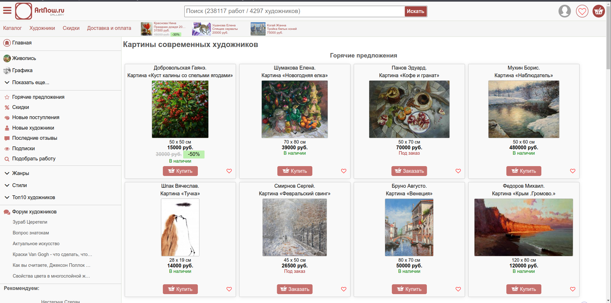

## Тестовый фреймворк для автоматизированного тестирования сайта artnow.ru

Этот проект представляет собой тестовый фреймворк, разработанный для автоматизации тестирования функциональности сайта "
artnow.ru - купить картины современных художников и другие произведения".

Тестируемый сайт: https://artnow.ru/




*это выглядит мега печально...*

## Технологии

- Язык программирования – Java 21
- Сборка проектов – Gradle 8.6
- Фреймворк для тестирования – testng (предварительно)
- Репортинг – Allure
- Selenium WebDriver

## Часть 1: создание фреймворка для автоматизированного тестирования GUI

- Создание фреймворка автоматизированного тестирования GUI сайта

*Создать фреймворк для автоматизированного тестирования* GUI сайта "Картины современных
художников" (<https://artnow.ru/> ), который должен удовлетворять следующим требованиям:

1. реализует паттерн Layered Architecture Pattern;

2. использует систему отчетности Allure;

3. при фейле теста *делает скриншот экрана*.

4. реализация фреймворка должна вестись *с использованием GIT системы*, результаты работы должны быть *опубликованы в
   GIT репозитории github / gitlab*.

5. использовать *явные ожидания, если необходимо*.

6. поддерживает *работу с двумя браузерами* Google Chrome, Firefox.

7. реализует паттерн Page Object для страниц сайта.

8. реализует *доступ к обьектам страницы* через CSS или XPath локаторы.

## Часть 2: реализация тестовых сценариев

- [x] 1_. Перейти в “Вышитые картины”, *произвести поиск по жанру* «Городской пейзаж», *проверить*, что картина “Трамвайный путь” *присутствует в выдаче*.
- 
- [x] 2_. Перейти в “Вышитые картины”, *произвести поиск по жанру* «Городской пейзаж», *открыть подробности* картины “Трамвайный путь”, *проверить, что стиль картины* «Реализм».

- [x] 3_. Перейти в “Батик”, *добавить первую картину в избранное*, проверить, что *выбранная картина сохранилась* в разделе «Избранное».

- [x] 4_. *Ввести в поисковую строку* «Жираф», проверить, что *название первой картины содержит слово* «Жираф».

- [x] 5_. Перейти в “Ювелирное искусство”, *добавить первое изделие в корзину*, проверить, что *выбранный товар находится в
   корзине*, *стоимость товара не изменилась*.

## Критерии оценки

1. Код должен быть *отформатированным, читаемым и задокументированным*.
2. Автотесты должны быть *корректно разделены на тесты и сопутствующие классы*.
3. Каждый тест *проверяет конкретный сценарий и возвращает систему в исходное состояние*.
4. Тесты должны быть *стабильными и должны запускаться параллельно* в 2 или 4 потока.
5. Отчет *allure должен содержать скриншоты*.

## Результаты

```bash
gradle test
```

### Результаты выполнения


### Видео-демонстрация


P.S. для демонстрации был убран параметр --headless

### Allure

```bash
> allure generate allure-results --clean
Report successfully generated to allure-report

> allure serve
```


